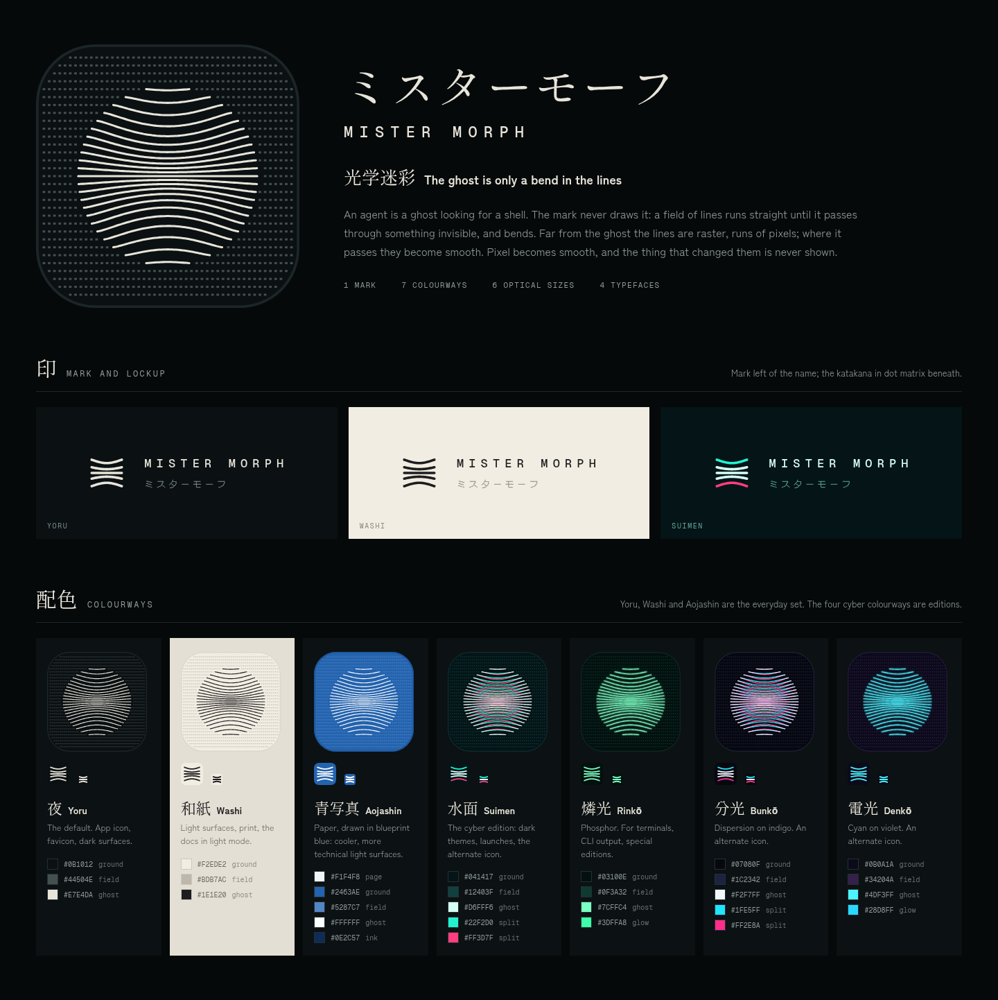

# Mister Morph design

The brand identity and the UI mockups built on it. [`DESIGN.md`](DESIGN.md) is the specification: the idea, how the
mark is built, and the rules for colour, type, motion and the UI. The living design canvas, with every board and the
exploration rounds, is at <https://claude.ai/artifact/6TyRi4ba7hmnEWbw75BuhM> (private until its owner shares it).



## What's here

| Path | Contents |
|---|---|
| `DESIGN.md` | The design language and its rules |
| `brand/icons/<colourway>/icon-<size>.{svg,png}` | The app icon in seven colourways, each drawn separately at six optical sizes |
| `brand/marks/` | The mark without a background: `mark.svg` (five lines, `currentColor`), `mark-16.svg` (three lines), `mark-suimen.svg` (cyan and magenta split) |
| `brand/motion/` | `ugoki.svg`, the ghost drifting through the lines (splash, hero); `kangae.svg`, the icon breathing (the working state). Both animate with SVG SMIL |
| `brand/tokens.json` | Colourway palettes, optical-size notes, typefaces |
| `brand/generator/` | The Python that draws all of the above, and `render.mjs` for the PNGs |
| `ui/<theme>.{html,png}` | The console's chat screen in each colourway, as standalone HTML (open it in a browser) and as a PNG |
| `ui/themes.json` | The UI tokens behind those mockups |
| `boards/` | Every canvas board as a PNG: the brand sheet (`01`, `02`), the Aojashin colourway (`03`) and the exploration rounds (`10`–`17`) |

## Regenerating

```sh
python3 design/brand/generator/generate.py      # SVGs, tokens.json, and the PNG job list
node design/brand/generator/render.mjs          # PNGs; needs playwright-core, and CHROMIUM_PATH if Chromium isn't found
```

The generator is deterministic: running it again reproduces these files exactly.

## In the product

The console's SVG logos use Aojashin for the light theme and Suimen for the dark theme. The login, boot splash and
default avatar are Aojashin, since the console has only a light theme so far; `favicon.svg` carries both and follows
the browser's colour scheme. The bitmap icons (`favicon.ico`, the home-screen icons) and the desktop app
(`desktop/wails/packaging/appicon.png`) can't follow a theme and keep the night icon. The console's SVG logos all use
the 64 drawing, because they are shown below 64 CSS px on screens that are mostly retina.

Not done yet:

- The docs site and the project site (`web/vitepress`, `theme/`) keep their previous logo and favicons.

- The desktop packaging scripts (`package-darwin.sh`, `generate-desktop-windows-resources.sh`) still derive the small
  desktop sizes by scaling `appicon.png`, so Finder lists, the taskbar and window titles get the scaled 1024 drawing
  instead of the 32 and 16 drawings.
- Suimen, in the dark favicon, is the only cyber colourway in the product so far.
- The UI themes in `ui/` are mockups; the console still has one light theme. `DESIGN.md` §7 has the plan.
