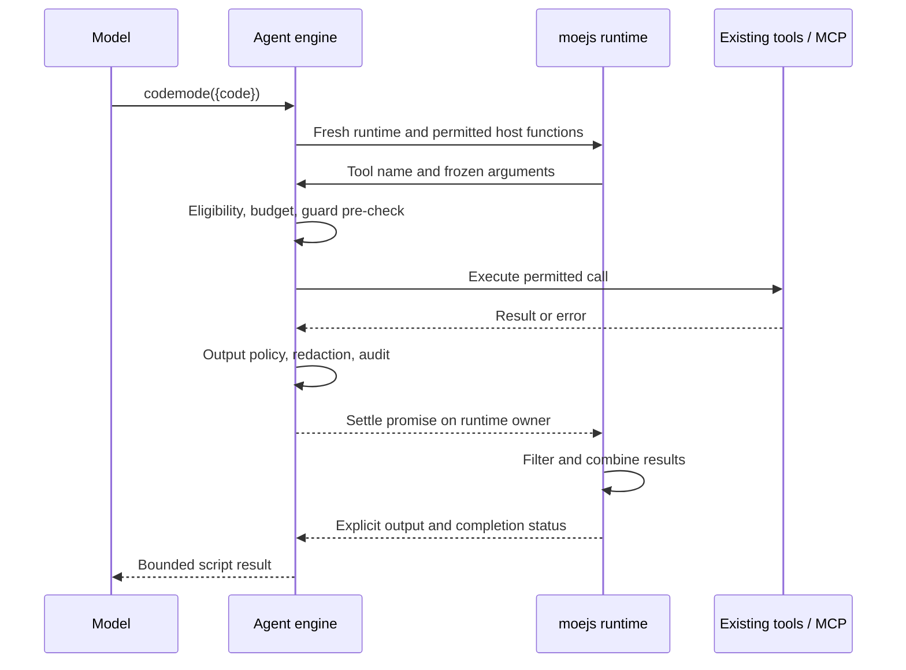

# Code Mode for tool orchestration with moejs

## Goal

Let the model write JavaScript that calls MisterMorph tools, combines their results, and returns only the information needed for the next model step. Use moejs as the JavaScript runtime.

Code Mode complements [MCP tool search](feat_20261006_tool_search_progressive_disclosure.md). Search reduces the definitions sent to the model. Code Mode reduces model round trips and the intermediate results sent back to it.

This is a design proposal. This change adds no runtime code or dependency.

## Design references

[Pi Codemode](https://pi.dev/docs/latest/codemode) runs JavaScript that calls host tools, supports parallel calls, and exposes discovery helpers. Only selected script output reaches the model. We adopt that interaction pattern, while keeping MisterMorph's provider interface and execution policy.

Cloudflare demonstrated [agent-side code orchestration](https://blog.cloudflare.com/code-mode/) and later [server-side search and execution](https://blog.cloudflare.com/code-mode-mcp/). This proposal runs orchestration in MisterMorph. It does not require changing MCP servers.

### moejs findings

Reviewed on 2026-10-07 at commit [`81508091e81452055003d1459f84c4323ca8303d`](https://github.com/Calcium-Ion/moejs/tree/81508091e81452055003d1459f84c4323ca8303d):

- moejs is pure Go, requires Go 1.25, supports async functions and host promises, and is currently alpha. The repository already uses Go 1.25. [README](https://github.com/Calcium-Ion/moejs/blob/81508091e81452055003d1459f84c4323ca8303d/README.md)
- One goroutine owns a runtime. Interrupts can come from another goroutine. Host promise settlement must run on the runtime's owner, and settlement can execute queued JavaScript jobs. [Runtime API](https://github.com/Calcium-Ion/moejs/blob/81508091e81452055003d1459f84c4323ca8303d/runtime.go), [Promise API](https://github.com/Calcium-Ion/moejs/blob/81508091e81452055003d1459f84c4323ca8303d/promise.go)
- Imports are host-controlled. Dynamic code can be disabled; those options do not limit the host's initial compilation. Value conversion can invoke JavaScript getters and other user code. [Guide](https://github.com/Calcium-Ion/moejs/blob/81508091e81452055003d1459f84c4323ca8303d/docs/guide.md)
- A per-realm heap or allocation budget is not implemented. [Known limits](https://github.com/Calcium-Ion/moejs/blob/81508091e81452055003d1459f84c4323ca8303d/TODO.md)

Pin the dependency to a reviewed revision during implementation. Do not treat the upstream plugin benchmarks as evidence of MisterMorph performance or sandbox security.

## Current integration points

- `tools.Tool.Execute` returns text and an error. MCP adapters also format their results as text today.
- The engine checks tool visibility and guard policy before execution, then applies output policy and redaction afterward. These operations are spread across `agent/engine_loop.go`; calling `Tool.Execute` directly would skip part of this path.
- `agent/tool_search.go` maintains direct tool visibility and adds found tools between model steps. The runtime's `ToolCatalog` connects configured MCP servers and owns task connections.
- Approval resume records one pending tool call and the remaining model-issued calls. It does not serialize a JavaScript stack or pending promises.
- Per-run state lives in the engine loop, not in tools: the visible tool set, per-tool run counts for `tool_repeat_limit`, guard pre-checks and post-redaction, tool events and hooks, the plan, and the reaction flag. A `tools.Tool` only receives `Execute(ctx, params)` and cannot reach any of it.

The implementation must reuse these mechanisms and make their boundaries explicit. It must not create a second execution path with fewer checks.

## First-version scope

Add one engine-owned tool named `codemode`. It can discover and invoke eligible built-in, runtime, embedder, and MCP tools. Keep existing direct tools and `tool_search` available under their current rules.

To the model, `codemode` is an ordinary function tool with a JSON schema. In the code it is not a `tools.Tool` in the registry: it lives in `agent/` as an engine option (for example `WithCodeMode`), the way `tool_search` does, so that nested calls go through the engine's own per-call path (visibility, guard, repeat counts, redaction, events) with the run's state. The engine handles a `codemode` call itself instead of looking it up in the registry.

The first version includes async JavaScript, bounded tool concurrency, sequential composition, local result filtering, and tool discovery. It excludes TypeScript execution, persistent JavaScript state, direct model APIs, and automatic script replay.

Use an ordinary JSON tool schema for all providers, including the existing tool-emulation path. Pi's raw-source tool input is not required for this version.

```json
{
  "code": "const results = await Promise.all([tools.read_file({path: 'README.md'}), tools.read_file({path: 'go.mod'})]); text(results.map(value => value.slice(0, 800)));"
}
```

`code` is required and must be a nonempty string. Interpret it as the body of an async function, so top-level `await` and `return` work. Markdown fences and TypeScript syntax produce a useful syntax error rather than heuristic source rewriting. Error positions refer to lines of `code` itself, not to the wrapper around it.

## Configuration

```yaml
tools:
  codemode:
    enabled: true
    timeout: "120s"
    max_tool_calls: 32
    max_parallel_calls: 4
```

- On by default for every runtime built through shared task preparation; `enabled: false` turns it off. Embedders get it only by passing the engine option. `$codemode` cannot turn it on when configuration turns it off.
- When enabled, shared task preparation passes the engine option; embedders pass the same option themselves. A registered tool already named `codemode` fails preparation without being replaced.
- All numeric limits must be positive. The effective timeout is the shortest of this setting, the enclosing tool-call timeout, and the remaining task deadline. The engine's tool-call timeout covers a whole batch of model-issued calls, not each call, so a script shares it with the calls before it in the same batch.
- No `only` mode in this version: direct calls remain available for simple operations and approval handling.
- Add the settings to `assets/config/config.example.yaml` and the Console settings model. Console-managed and standalone runtimes use the same values.

Decision and lightweight precheck requests do not gain Code Mode. Subtasks are never given `codemode`, like `tool_search`, and retain their existing restrictions, including `DisableRuntimeTools`; enabling the feature must not restore excluded capabilities.

## JavaScript API

| Global | Contract |
| --- | --- |
| `tools[name](args)` | Call an eligible tool; returns a promise of its post-policy text result |
| `searchTools(query, options?)` | Return bounded tool and server matches; `options` accepts `server` and `limit` |
| `describeTool(name)` | Return `{ name, description, inputSchema }` for an eligible, known tool, or an explicit unavailable error |
| `text(value)` | Append a string or JSON-serialized value to the script output |
| `console.log(...values)` | Append a bounded diagnostic line to the same output stream |
| `return value` | Append a final non-undefined value using the same rules as `text` |

Use exact registered names. For example, `tools["mcp_github-work__get_issue"](...)` handles names containing a hyphen. Do not invent normalized aliases that can collide. Only registered own properties are callable; names such as `constructor` and `__proto__` must not expose host objects or inherited functions.

Tool arguments must be a JSON object. Freeze a validated JSON copy before dispatch so later JavaScript mutations cannot change an approved or queued call. Reject cycles and values that cannot be represented faithfully, including functions, symbols, BigInt, and non-finite numbers. Do not export arbitrary Go objects or runtime pointers into JavaScript.

### Tool results

Keep the current text return contract. A script may use `JSON.parse` when a tool documents a JSON result, but the bridge must not guess whether text is JSON or silently change its type.

Ordinary tool failures reject the promise with a bounded, sanitized error containing the tool name and available error observation. Scripts can use `try/catch` or `Promise.allSettled` to recover. Apply output policy and redaction before either a result or an error becomes visible to JavaScript.

Do not claim access to raw MCP `structuredContent` or binary image blocks through the current adapter. Structured tool results and an `image()` helper need a separate result-contract change and are outside this version.

### Discovery and visibility

Reuse existing MCP catalog filtering, search ranking, connection ownership, and discovery limits. Add local-tool matching to the script helper using the task's eligible registry; do not maintain another global catalog or ranking service.

- Without `server`, `searchTools` searches eligible local tools, connected MCP metadata, and configured server summaries. It opens no new connection.
- With `server`, it connects only that enabled, valid server when needed and searches its allowed tools. It returns the same tool/server distinction and result bounds as direct `tool_search`.
- `describeTool` returns the original JSON input schema. It neither executes the tool nor connects an unselected server just because a guessed name contains its prefix.
- A scoped search can make selected tools callable within the script after its promise resolves. This is a deliberate extension of the direct tool-search rule, which still activates tools only on the next model step.
- Script discovery does not append every found schema to the provider's `Request.Tools`. Keep script-callable names separate from direct visibility, with a shared eligible catalog and discovery budget. Describing or invoking a guessed hidden name must not bypass selection or limits.
- Script selections last for the current task run. Existing conversation-sticky direct tools keep their behavior. Cross-turn script selections and data storage are outside this version.
- A direct call to a found tool records it as used for the conversation (`topics/<topic>/found_tools.json`), which keeps it visible in later turns. A nested call does not record that: using a tool inside a script never makes it visible to the model in this or a later turn. The only way a script affects direct visibility is the approval handoff below, for that one tool and the next model step.

When tool search is disabled, script discovery sees only the tools already registered and available for the task. Code Mode must not independently enable on-demand MCP discovery in that configuration.

The system prompt briefly explains the script API, discovery, text result contract, and approval handoff. It must not list every MCP schema or duplicate the full tool catalog inside the `codemode` description. JSON schemas returned by `describeTool` are sufficient for v1; generating TypeScript declarations is optional future work.

## Execution flow



Use one fresh moejs runtime per invocation. Do not pool runtimes or share JavaScript objects between tasks. Destroy the invocation's state when it finishes, fails, or is cancelled.

One goroutine owns all JavaScript operations, including argument conversion, promise creation and settlement, and result serialization. Tool workers return plain copied data through a bounded queue. They must never call moejs settlement or conversion functions themselves.

The owner drives promise completion until the entry function settles or the invocation ends. A pending promise with no remaining host work must terminate with an unresolved-promise error rather than leave the task hanging. Track unhandled rejections; an ignored rejected promise cannot turn a failed invocation into reported success.

### Ending an invocation

Cancelling a tool that has already started is what makes an outcome uncertain, so the invocation cancels started work only when it has to:

| How it ends | Queued calls (not started) | Started calls |
| --- | --- | --- |
| Entry function settles, including with unawaited calls | Dropped, reported as `not_started` | Finish within the deadline; their outcomes are reported, never delivered to JavaScript |
| Script error, output limit, or approval handoff | Dropped, reported as `not_started` | Finish within the deadline, as above |
| Timeout or cancellation of the task | Dropped, reported as `not_started` | Context cancelled; reported as `cancelled` with an unknown outcome |

Waiting for started calls is bounded by the same effective deadline. When the deadline passes while waiting, the remaining calls are cancelled and reported as above. No path starts a queued call after the script has ended.

### Ordering and concurrency

Reuse `tools.ParallelSafe`: only calls explicitly safe for parallel execution may overlap. Other calls run in issue order, after earlier calls finish, and block later dispatch until completion. `Promise.all` expresses potential concurrency; it does not override tool safety.

The outer `codemode` invocation is not parallel-safe with other outer tool calls. Do not let a model's batch race script discovery or script mutations against a direct call in the same engine.

Assign each nested call an ID derived from the outer call ID and its issue index. Record start, completion, failure, and cancellation through existing hooks and events. Serialize guard decisions and shared run-state updates rather than assuming the whole engine is safe to call concurrently.

### Activity display

Nested calls fire the same tool hooks and events as direct calls, so existing consumers keep working (the CLI, for example, snapshots files in `onToolCallStart` to show `write_file` diffs). Each nested call carries the outer call's ID: a parent activity ID on its events, and a parent ID on the `ToolCall` the hooks receive (never sent to the provider). Displays group nested calls under their script:

```
Activity
  ✓ codemode  3 calls                2.1s
      ✓ mcp_github__list_issues  app 0.8s
      ✓ mcp_github__list_issues  web 0.9s
      ✓ read_file  notes/triage.md   0.0s
```

- Console: a script and its nested calls form one activity entry, so a script with many calls takes one of the panel's 24 history slots and pushes nothing else out. The nested list is bounded the same way, keeping the most recent calls and a count of earlier ones.
- CLI chat: nested calls print indented under the `codemode` line.
- A failed nested call shows as failed inside its script entry, so the failing operation is visible without opening logs.

Each nested attempt consumes the invocation's call budget and relevant existing run limits, including repeat detection. Discovery operations also consume the invocation budget. An outer call must not hide unlimited work from run accounting. A script counts as one step toward `max_steps`, however many calls it makes; `max_tool_calls` and `tool_repeat_limit` bound the calls.

### Tools a script cannot call

Some tools change the engine's run state when they finish, not just their own output. Calling them from a script would need that engine behavior reproduced inside the bridge, so v1 excludes them:

| Tool | Why |
| --- | --- |
| `codemode` | No recursion |
| `tool_search` | Changes direct visibility between model steps; scripts use `searchTools` |
| `plan_create` | Its result becomes the run's plan |
| `message_react` | Sets the run's reaction flag, which changes how the final reply is sent |
| Tools with `StopAfterSuccess` | End the batch, and with it the run, after success |
| `bash`, `powershell` | Need approval whenever guard approvals are on, and run freely inside a script when they are off; v1 scripts read and combine, they do not run commands |
| `skill_install` | Always needs approval |

An excluded tool is absent from `searchTools`, `describeTool` reports it unavailable, and `tools[name]` rejects with an error that tells the model to call it directly. The model can still call it directly, outside the script. The list is defined in one place next to the engine code that gives these tools their behavior, so a new tool of this kind is excluded where it is added.

## Approval and partial execution

Do not approve only the outer script and treat all its calls as authorized. Every nested tool call gets its own pre-check under the same task identity and policy as a direct call. Forced-approval tools keep that requirement even when the guard is otherwise disabled.

A guard **deny** rejects the call's promise with the same observation a direct call gets ("blocked by guard"); the script can catch it and continue. Only a decision that **requires approval** starts the handoff below.

With `bash`, `powershell` and `skill_install` excluded, no built-in tool needs approval inside a script today. The handoff remains the rule for any call the guard asks approval for, now or after a policy change.

For v1, use a **direct-call handoff** when a nested call requires approval:

1. Do not execute that call. Stop the script and close its dispatch queue. This is a host control outcome, not a JavaScript exception that can be caught to keep issuing calls.
2. Record completed calls and the exact tool name and frozen arguments that need approval. Drop calls that have not started, and let started calls finish within the deadline (see "Ending an invocation"). Report every outcome without claiming rollback.
3. Return `status: "requires_direct_call"`, partial output, and the pending call. Make that eligible tool directly visible on the next model step if it was selected only for the script.
4. The model submits the pending operation as a normal direct tool call. The existing approval path evaluates and persists that action. Changing arguments requires a fresh evaluation; the script result is not an approval token.
5. After that operation completes, the model may submit a new script using the known results. Never rerun the original script automatically.

This preserves the existing durable approval workflow without storing a JavaScript continuation. Approval resume executes the pending direct action, not the earlier script. If no approval store is available, keep the existing denial behavior.

An outer `codemode` call may itself be approval-gated by host policy. Approval before any script execution can use the existing resume path, but grants no exemption to nested calls.

Completed side effects remain completed after syntax-independent runtime errors, timeouts, or later denials. The final status and nested-call trace must make that clear. Script failure is not a transaction rollback, and provider retries must not silently re-execute a completed script invocation.

## Sandbox and resource limits

Install only the documented bridge globals and standard JavaScript builtins. Use frozen intrinsics, no importer, and `DisableDynamicCode: true`. Reject static imports and allow no host module resolver. Do not install filesystem, network, environment, process, shell, timers, Node, or Go reflection APIs.

An eligible `bash`, `read_file`, or network tool still grants its normal capability through the checked bridge. The sandbox prevents direct access; it does not make those tools harmless or widen their permissions.

Initial implementation limits:

| Resource | Bound |
| --- | --- |
| User source | 64 KiB UTF-8, checked before compilation |
| Invocation duration | Effective configured deadline, including tool waits |
| Host operations | `max_tool_calls`, including discovery and failed attempts |
| Concurrent tool executions | `max_parallel_calls`, further restricted by tool safety |
| One tool argument object | 256 KiB serialized JSON |
| One result delivered into JavaScript | 1 MiB UTF-8 |
| Aggregate tool-result data per invocation | 8 MiB UTF-8 |
| Model-facing output | 64 KiB UTF-8 and at most 256 output items |
| Boundary serialization depth | 64 levels |

These fixed byte limits are implementation constants in v1, not another set of configuration keys. Reject oversized arguments before dispatch. An oversized result must produce an explicit result-limit error, including whether execution already occurred; never silently truncate JSON that the script may parse. Bound output incrementally, preserve the earlier output, and stop with an output-limit status.

Keep the deadline armed during JavaScript execution and conversions that can invoke user code. Cancellation interrupts the runtime and cancels tool contexts. Initial host compilation is source-size bounded; moejs's runtime interrupt does not by itself provide a hard preemption guarantee for that compiler call. Check cancellation again before loading or invoking compiled code.

On termination, reject new calls, drop queued host work, handle started work as "Ending an invocation" describes, and prevent late results from entering a finished runtime. A tool that ignores cancellation may already have produced an external effect; report uncertainty and do not retry it automatically. No runtime reuse means late interrupts cannot affect another task.

### Memory limitation

V1 embeds moejs in the Go process. This provides a controlled capability surface, **not a hard memory or process-isolation boundary**. Source, result, and output caps do not bound JavaScript heap allocations or every temporary allocation during serialization. An allocation-heavy script can still exhaust the host process.

Do not advertise `max_memory_bytes`, claim that Go's process-wide soft memory limit is a per-script quota, or call an output cap a heap limit. The feature is on by default, so document this limitation for operators along with `tools.codemode.enabled: false`. Hard memory containment would require a verified runtime allocation limit or a separately constrained worker process; either is separate work, not a hidden requirement for this first implementation.

#### Memory monitoring

moejs keeps no per-runtime allocation count, so script memory can only be observed through the process. While at least one invocation runs, one watcher samples the process heap every 100 ms through `runtime/metrics`, which does not stop the world: `/memory/classes/heap/objects:bytes` for the current heap (`/gc/heap/live:bytes` only changes at each GC) and `/gc/heap/allocs:bytes` for bytes allocated.

- Each invocation reports its approximate peak heap growth and bytes allocated in its result diagnostics and logs. Other tasks allocate at the same time, so these are labelled approximate.
- When the current heap passes a ceiling (90% of the Go memory limit when one is set, otherwise a fixed implementation constant), the watcher interrupts every running invocation with a `memory_limit` status and logs a warning. Their started tool calls are handled as on cancellation.

This is a safety net, not a quota: a single large allocation between samples can still exhaust the process, and an interrupted script may not be the one that allocated.

## Results and diagnostics

Return a structured outer result with `status`, ordered `output`, elapsed time, and a compact list of nested calls and their outcomes. Include the pending name and arguments only for an approval handoff. Suggested statuses are `completed`, `failed`, `timed_out`, `cancelled`, `output_limit`, `memory_limit`, and `requires_direct_call`. Each nested call reports `succeeded`, `failed`, `denied`, `not_started`, or `cancelled` (outcome unknown).

Only explicit output and bounded host diagnostics enter model context. Full intermediate results are not appended as separate model messages. Keep nested audit records and UI events even when the script prints nothing.

Apply normal logging and redaction settings to source, arguments, and observations. Info logs contain counts, durations, and status rather than source code, credentials, or full results. Link nested call events to the outer call so a failure can be traced to the actual operation.

## Runtime coverage and compatibility

Integrate through shared task preparation and the engine so CLI, Console, Console-managed channels, standalone channels, awareness, cron, TODO, heartbeat, and permitted handoffs behave consistently. This does not create a channel context that a tool did not already have.

Keep MCP session lifecycle in the existing task catalog. Script termination ends script work; task-owned MCP sessions close according to the surrounding task's existing cleanup rules. Startup-owned sessions are not closed by Code Mode.

Existing `$tool`, `$skill`, and `$mcp_<name>` references keep their meaning. Disabling Code Mode restores current behavior without changing MCP configuration or direct tool visibility. An unsupported provider reports the normal tool-call limitation; it must not fall back to executing the script through unrestricted `bash`.

## Acceptance criteria

| Case | Expected result |
| --- | --- |
| Disabled feature | Existing prompts, tools, and execution behavior unchanged |
| Default configuration | `codemode` offered by shared task preparation; not offered to subtasks or decision requests |
| Heap ceiling reached | Running invocations interrupted with `memory_limit`; started calls reported as cancelled |
| Sequential dependent calls | Later call receives the earlier result without an intermediate model request |
| Parallel-safe calls | Calls overlap up to the configured limit; returned values map to the right promises |
| Non-parallel-safe calls | Calls retain issue order and do not overlap other tool executions |
| Filtering a large result | Model sees only selected output; audit still records the underlying operation |
| Hidden MCP discovery | Existing server policy and limits apply; selected tools become script-callable without bulk schema disclosure |
| Disabled or excluded tool | Search, description, guessed names, and script invocation cannot reach it |
| Activity display | Nested calls appear under their `codemode` entry in the Console (one history slot) and indented in the CLI; hooks still fire for them |
| Engine ownership | `codemode` is not in the tool registry; nested calls update the run's repeat counts and emit tool events like direct calls |
| Invalid arguments and result errors | Normalized errors; no mutation of queued arguments; output policy runs before script access |
| Nested denial | Promise rejects with the guard's reason; the script can catch it |
| Nested approval | No bypass; handoff identifies the exact pending operation and preserves completed-call status |
| Approval resume | Direct pending action resumes without replaying earlier script effects |
| Cancellation and endless loops | Runtime interrupted, further dispatch stopped, tool cancellation propagated |
| Pending or unawaited promises | No indefinite wait or silent background job; queued calls dropped as `not_started`, started calls finish within the deadline and are reported |
| Excluded engine tools | `codemode`, `tool_search`, `plan_create`, `message_react`, `StopAfterSuccess` tools and bash termination commands are not discoverable or callable from a script; direct calls still work |
| Found-tool stickiness | A nested call to a found MCP tool does not add it to the conversation's found tools |
| Source, output, depth, and call limits | Clear bounded failure at the relevant boundary |
| Forbidden globals, imports, or dynamic code | Access fails without reaching host resources |
| Concurrent invocations | No shared mutable JavaScript state or cross-task tool visibility |
| Error during conversion or serialization | Deadline and limits still apply; no host panic exposed as success |
| Provider emulation and fallback | Same function schema, bridge policy, and no automatic script replay |
| Shared runtime entry points | Correct cache, credentials, channel context, and child-task restrictions |

Use fake tools, fake model clients, and stub MCP transports. Test cancellation, promise settlement, and shared state with the race detector. Run potentially destructive allocation probes only in a separately bounded test process; do not claim an in-process heap quota from these tests.

Benchmark a fixed sequential workflow, a parallel-safe workflow, and a large-result filter against ordinary tool calls. Record model round trips, model-facing bytes, wall time, allocations, and correctness. Do not promise a token-reduction percentage before measuring representative tasks.

## Implementation sequence

Before each phase's production logic, add its tests and run them to establish the failing cases.

1. **moejs bridge:** pin the dependency, verify async promise ownership and cancellation, implement fresh invocations, JSON boundaries, output, and fixed limits. Confirm the memory limitation remains accurately documented.
2. **Engine dispatch:** add `codemode` as an engine option, route nested operations through existing policy and execution, preserve ordering and hooks, enforce budgets, exclude the engine-coupled tools, finish or drop outstanding calls as "Ending an invocation" describes, and implement direct-call approval handoff without replay.
3. **Discovery:** reuse the MCP catalog and search, add local metadata lookup, separate script access from direct visibility, and preserve task connection ownership.
4. **Integration and validation:** configuration, shared runtimes, Console, provider emulation, regression tests, benchmarks, and `docs/tools.md` examples.

Do not turn the default on or describe the feature as complete before nested policy checks, cancellation, partial-execution reporting, approval handoff and memory monitoring work together.

## Outside v1

- TypeScript compilation, package installation, module imports, or a general JavaScript application runtime.
- Persistent VM state, `store/load`, durable script continuations, or automatic replay.
- A Code-Mode-only tool surface that removes direct calls.
- Raw multimodal MCP results or direct access to classifier, image, or chat models.
- Runtime pooling, a distributed execution service, or hard per-script memory isolation.
